# Maddy BGMI Store 🎮

Welcome to the **Maddy BGMI Store**, South India's most trusted, premium, and secure marketplace for Battlegrounds Mobile India (BGMI) accounts, premium in-game assets, and direct gaming services. Since 2019, we have built a reputation for high-fidelity trading, cinematic UX, and uncompromised cybersecurity.

This repository hosts a full-stack, enterprise-ready web application utilizing a **dual-database sync system** (Supabase + Firebase) alongside high-performance edge architectures, customized Progressive Web App (PWA) utilities, and dynamic visual layouts.

---

## 🏗️ Working Architecture

To secure operations and maintain high performance, the system decouples client-side presentation, database storage, and secure serverless transaction flows. Here is the operational architecture of the platform:

```mermaid
graph TD
    %% Styling Definitions
    classDef client fill:#0d1117,stroke:#FFD700,stroke-width:2px,color:#fff;
    classDef firebase fill:#1a1510,stroke:#FF9100,stroke-width:2px,color:#fff;
    classDef supabase fill:#0c1c15,stroke:#3ECF8E,stroke-width:2px,color:#fff;
    classDef external fill:#171b22,stroke:#8b949e,stroke-width:1px,color:#fff;

    %% Nodes
    subgraph Client ["Client Layer (Vite 7 + React 18 + Tailwind v4)"]
        UI["Cinematic UI/UX (GSAP / Lenis / Motion)"]
        Router["React Router v6 Gates"]
        Store["State (Zustand + AuthContext)"]
    end
    class Client,UI,Router,Store client;

    subgraph AuthSecurity ["Identity & Security Gateway"]
        FBAuth["Firebase Auth (Custom JWT Claims)"]
        SecRules["Firestore Security Rules"]
        RLS["Supabase Row Level Security (RLS)"]
    end
    class AuthSecurity,FBAuth,SecRules,RLS client;

    subgraph FirebaseServices ["Firebase Backend Services"]
        Functions["Cloud Functions V2 (NodeJS)"]
        JWT["HS256 JWT Token Signer"]
        Lockout["5-Try PIN Brute-Force Lockout"]
        Firestore["Firestore DB (Payment Settings & Admin Lists)"]
    end
    class FirebaseServices,Functions,JWT,Lockout,Firestore firebase;

    subgraph SupabaseServices ["Supabase Backend Services"]
        Postgres["PostgreSQL Database"]
        RPC["site_views Increment RPC"]
        Tables["Catalog, Reviews, Proofs, Feedback tables"]
    end
    class SupabaseServices,Postgres,RPC,Tables supabase;

    subgraph Integrations ["External APIs & Integrations"]
        Cloudinary["Cloudinary (Asset CDN)"]
        GoogleSheets["Google Apps Script (Sales Logging)"]
        Vercel["Vercel Analytics & Edge Hosting"]
    end
    class Integrations,Cloudinary,GoogleSheets,Vercel external;

    %% Relations
    UI --> Router
    Router -->|Gated by Admin Claims| Store
    Store --> FBAuth
    
    %% Database routing
    Store -->|Public Reads / Pending Reviews| Tables
    Store -->|Admin Token Header| RLS
    RLS --> Tables
    
    %% Functions transactional routing
    Store -->|Call Secure Functions| Functions
    Functions -->|Sign / Validate Checkout| JWT
    Functions -->|Enforce Lockout State| Lockout
    Functions -->|Read/Write Admin Config| Firestore
    SecRules --> Firestore
    
    %% Atomic Views
    Store -->|RPC views update| RPC
    RPC --> Postgres
    
    %% Integrations
    UI -->|Image Uploads| Cloudinary
    Functions -->|Sync Orders/Feedback| GoogleSheets
    UI -->|Metrics| Vercel
```



### Architectural Flows
1.  **Storefront Content**: Public listings (BGMI accounts, UC bundles, gifting catalogs) are stored in **Supabase Postgres** tables. The client performs direct SELECT queries under public RLS permission models.
2.  **Payment Processing**: When an admin triggers checkout generation, **Firebase Cloud Functions (V2)** builds an immutable token signed with `HS256` JWT. The client uses this token to access the `/pay/:id` route, where the transaction details are verified.
3.  **Brute-Force Lockout Gateway**: During PIN validation on the checkout page, the input PIN is validated serverless. If a user inputs 5 wrong PINs, the Cloud Function writes a `revoked` state to Firestore, locking the payment link.
4.  **View Counts & Celebrations**: On first load, the client executes a secure **Supabase RPC** (`increment_views`) that atomically increments site views in Postgres and returns the updated milestone, triggering high-fidelity golden confetti canvas animations on the client when milestones (multiples of 10) are achieved.

---

## 🛠️ Current Tech Stack

The application employs a curated, cutting-edge tech stack designed to optimize load times, maintain data consistency, and defend transactional boundaries.

### 1. Frontend Presentation Layer
*   **Core Framework**: **React 18.3.1** (declarative component rendering, Suspense-driven lazy chunks)
*   **Build Bundler**: **Vite 7.3.3** (fast ES-module hot reloading, optimized vendor splitting assets)
*   **Styling Engine**: **Tailwind CSS v4.2.4** (efficient design tokens, utility classes, and optimized PostCSS preprocessing)
*   **Transitions & Animations**: 
    *   **GSAP 3.15.0**: Cinema-style loading grids, custom loaders, and vector timelines.
    *   **Framer Motion 12.38.0**: Responsive UI components, micro-animations, and fluid model transitions.
    *   **Lenis 1.3.23**: Smooth, GPU-accelerated scroll synchronization.
*   **State Managers**: **Zustand 5.0.13** (global UI, filters, and transaction states) + **React Context** (Firebase Auth state)

### 2. Dual Database & Storage Layer
*   **Supabase (PostgreSQL 15+)**: Handles relational operational schemas:
    *   `products`: Stores BGMI listings, metadata, Cloudinary image arrays, and YouTube embeds.
    *   `reviews` & `proofs`: Verified reviews with approval states and screenshot deliveries.
    *   `customer_feedback`: Star ratings and structured customer feedback.
    *   `site_views`: Atomic views counting table.
*   **Firebase Firestore**: Handles configuration metadata and operational state:
    *   `payment_links`: Secure checkout state, validation credentials, and lockout counters.
    *   `payment_settings`: UPI configs, bank details, and active link timers.
    *   `admins`: Real-time active manager UIDs.

### 3. Serverless Services & Security Layer
*   **Firebase Authentication**: Dynamic client sign-ins, managing admin user groups via custom administrative token claims `{ admin: true }`.
*   **Firebase Cloud Functions (V2 / Node.js 20)**: Secure backend runtime executing core endpoints (link creation, PIN verification, admin privilege allocation, lockout execution).
*   **JSONWebToken (`jose` / `jwt`)**: Cryptographic signature validation ensuring payment URLs remain tamper-proof.
*   **Row-Level Security (RLS)**: PostgreSQL-level access policies allowing direct client queries while gating database modifications under admin tokens.

### 4. Integrations & Tooling
*   **Cloudinary**: Remote image hosting and automatic visual transformations.
*   **Google Apps Script**: Real-time sheets logging for checkout operations, feedback forms, and notifications.
*   **Vercel Analytics & Speed Insights**: Real-time user experience metrics and load-speed telemetry.
*   **xlsx / pdf-lib / pdf-encrypt-lite**: Client-side document parser, Excel exporting, and secure transaction receipt encryption.

---

## 📂 Project Structure

```text
MBS Webapp/
├── frontend/                    # Vite + React 18 Application
│   ├── src/
│   │   ├── assets/              # Static media (emblems, logos, banner images)
│   │   ├── components/          # Global UI components (Navbar, Footer, ErrorBoundary, Loader)
│   │   ├── context/             # React Context Providers (AuthContext)
│   │   ├── hooks/               # Custom React hooks (usePageMeta)
│   │   ├── lib/                 # Third-party library initializations
│   │   ├── pages/               # Route components
│   │   │   ├── admin/           # Standard admin views (Stock, Reviews, Orders)
│   │   │   ├── services/        # Services catalogs (UC, X-Suit, Supercar)
│   │   │   └── Transactions/    # Financial & transaction management hub
│   │   ├── services/            # Direct Firebase & Supabase API functions
│   │   ├── store/               # Zustand global state modules
│   │   ├── styles/              # Global CSS & Tailwind CSS v4 configurations
│   │   ├── utils/               # Supabase and utility configurations
│   │   ├── App.jsx              # Application router & main bootstrap
│   │   └── main.jsx             # React entry point
│   ├── public/                  # Static web resources (icons, manifest configuration)
│   ├── index.html               # Main HTML wrapper
│   ├── vite.config.js           # Production-optimized Vite bundler config
│   ├── vercel.json              # Vercel SPA routing fallback rules
│   └── package.json             # Frontend script, assets & dependencies
│
├── backend/                     # Database schemas & serverless functions
│   ├── functions/               # Firebase Cloud Functions (V2 Node.js)
│   │   ├── index.js             # API routes (JWT signer, Lockouts, Admin managers)
│   │   └── package.json         # Node.js dependencies
│   ├── supabase/                # PostgreSQL schemas
│   └── sql/                     # Supabase SQL initialization & security setups
│
├── README.md                    # Main Project Documentation
└── .env                         # Master configuration (git-ignored)
```

---

## 💻 Getting Started

### Prerequisites

*   [Node.js](https://nodejs.org/) v18+ and `npm`
*   [Firebase CLI](https://firebase.google.com/docs/cli) installed globally (`npm install -g firebase-tools`)
*   Active Firebase and Supabase project instances

### 1. Environment Configurations

Create a `.env` file in the root of the project (or inside `frontend/`) and set up your system tokens:

```env
# Firebase Client SDK Credentials
VITE_FIREBASE_API_KEY=AIzaSyC...
VITE_FIREBASE_AUTH_DOMAIN=bgmistore-XXXX.firebaseapp.com
VITE_FIREBASE_PROJECT_ID=bgmistore-XXXX
VITE_FIREBASE_STORAGE_BUCKET=bgmistore-XXXX.firebasestorage.app
VITE_FIREBASE_MESSAGING_SENDER_ID=909XXXXXXXX
VITE_FIREBASE_APP_ID=1:909XXXX:web:8cXXXXXX
VITE_FIREBASE_MEASUREMENT_ID=G-XXXXXXXX

# Whitelisted Super Admin UIDs (Firebase Authentication)
VITE_ADMIN_UID=yJDe1mSh28W1nfoVifZSomR6TiO2
VITE_ADMIN_UID_2=FOv8lMfou9cy6QPtaep5zF2qiP92

# Supabase Configurations
VITE_SUPABASE_URL=https://jpndxwivezindljsgtgo.supabase.co
VITE_SUPABASE_PUBLISHABLE_KEY=sb_publishable_XXXX...
VITE_SUPABASE_ADMIN_TOKEN=mbs_admin_supabase_token_2026_xyz

# Cloudinary Integration
VITE_CLOUDINARY_CLOUD_NAME=dkvyv4ooq
VITE_CLOUDINARY_UPLOAD_PRESET=mbs_reviews

# Google Sheets Analytics & Apps Script
VITE_GOOGLE_SCRIPT_URL=https://script.google.com/macros/s/XXXX...
VITE_APPS_SCRIPT_API_KEY=mbs_secure_api_key_2026_xyz
```

### 2. Frontend Installation & Local Server

To install packages and run the client-side server locally:

```bash
cd frontend
npm install
npm run dev
```

The app will mount at `http://localhost:5173`.

### 3. Serverless Cloud Functions Setup

Install dependencies and start emulator or deploy:

```bash
cd backend/functions
npm install
```

To deploy rules and functions to live environment:

```bash
cd backend
firebase deploy --only functions
firebase deploy --only firestore:rules
```

---

<div align="center">
  <i>Made with ❤️ in South India for the Global BGMI Community.</i>
</div>
