# Technical Architecture & File Structure

This document provides a detailed overview of the MaddyBgmistoreV2 codebase, monorepo architecture, technology stack, and database schema, including an Entity-Relationship (ER) diagram.

---

## 1. Project Overview

**MaddyBgmistoreV2** is a premium web platform designed to facilitate transactions for Battlegrounds Mobile India (BGMI) assets. It supports storefront cataloging, user authentication, checkout generation, and a fully featured admin control panel. The system is split into two primary applications:
1. **Web Storefront (`apps/web`)**: A public-facing marketplace allowing users to browse UC deals, accounts, custom X-Suits, supercars, read reviews, submit feedback, and view deal proofs.
2. **Admin Portal (`apps/admin`)**: An administrative dashboard for managing accounts, reviewing feedback, updating payment settings, verifying transactions, and generating checkout links.

---

## 2. Monorepo File Structure

The project is structured as a **Turborepo** monorepo workspace to support clean separation of concerns and reuse shared configurations.

```
MaddyBgmistoreV2/
├── apps/                         # Independent Frontend Applications
│   ├── web/                      # Public storefront app (Next.js)
│   └── admin/                    # Admin portal with basePath "/admin" (Next.js)
├── packages/                     # Shared workspace packages
│   ├── db/                       # Drizzle ORM schema, migrations, & client
│   ├── auth/                     # Shared authentication helpers & Clerk integrations
│   ├── typescript-config/        # Shared tsconfig.json configurations
│   ├── eslint-config/            # Shared ESLint configuration rule presets
│   ├── ui/                       # Shared styling & component library
│   ├── types/                    # Shared TypeScript types & interfaces
│   ├── validation/               # Zod validation schemas for data transfer
│   └── lib/                      # Reusable utilities (Sentry, formatting, APIs)
├── docs/                         # System documentation and blueprints
├── package.json                  # Workspace workspaces & scripts
└── turbo.json                    # Turborepo task pipeline configuration
```

---

## 3. Technology Stack

*   **Monorepo Pipeline**: [Turborepo](https://turbo.build/)
*   **Web Framework**: [Next.js](https://nextjs.org/) (App Router, React server components)
*   **Database**: PostgreSQL
*   **Object-Relational Mapping (ORM)**: [Drizzle ORM](https://orm.drizzle.team/)
*   **Authentication & Identity**: [Clerk](https://clerk.com/)
*   **Error Monitoring**: [Sentry](https://sentry.io/)
*   **Animations**: [Framer Motion](https://www.framer.com/motion/)
*   **Styling**: Vanilla CSS, Tailwind CSS

---

## 4. Database Architecture & ER Diagram

The database utilizes PostgreSQL and is structured around two main flows: the **Catalog Cataloging** flow (products, UC prices, X-Suits, Supercars, Reviews, Proofs) and the **Transaction Logs** flow.

```mermaid
erDiagram
    PROFILES {
        string id PK "Clerk User ID"
        string email UK
        user_role role
        timestamp created_at
        timestamp updated_at
    }

    PRODUCTS {
        uuid id PK
        string title
        string description
        numeric price
        string category
        string status
        string youtube_url
        string primary_login
        string secondary_login
        string unlink_guarantee
        string tag
        string_array image_urls
        timestamp created_at
    }

    UC_PRICES {
        uuid id PK
        integer uc_amount
        numeric market_price
        numeric offer_price
        integer bonus_uc
        string method
        string tag
        timestamp created_at
    }

    XSUIT_GIFTS {
        uuid id PK
        string name
        numeric price
        string image_url
        string tag
        timestamp created_at
    }

    SUPERCAR_GIFTS {
        uuid id PK
        string name
        numeric price
        string type
        string image_url
        string tag
        timestamp created_at
        timestamp updated_at
    }

    REVIEWS {
        uuid id PK
        string name
        string comment
        integer rating
        string status
        timestamp created_at
    }

    PROOFS {
        uuid id PK
        string title
        string image_url
        string month
        string year
        timestamp created_at
    }

    ADMIN_PAYMENT_SETTINGS {
        integer id PK
        string payee_name
        string payee_upi_id
        string bank_name
        string account_type
        string account_holder
        string account_number
        string ifsc_code
        string branch
        timestamp updated_at
    }

    PAYMENT_LINKS {
        uuid id PK
        string access_token UK
        string transaction_id
        string customer_name
        numeric amount
        string status
        timestamp expires_at
        string note
        string pin
        string upi_id
        string payee_name
        jsonb bank_details
        integer failed_attempts
        timestamp revoked_at
        string revoked_reason
        timestamp created_at
    }

    SITE_VIEWS {
        string id PK
        bigint count
        timestamp updated_at
    }

    CUSTOMER_FEEDBACK {
        uuid id PK
        string name
        integer stars
        string comment
        string desired_items
        string phone
        string status
        timestamp created_at
    }

    TRANSACTIONS {
        uuid id PK
        string transaction_id UK "e.g., MBSA403"
        string buyer_name
        string buyer_phone
        string buyer_contact
        numeric total_amount
        string mode_of_deal
        date deal_date
        timestamp created_at
    }

    ACCOUNT_TRANSACTIONS {
        uuid id PK
        string transaction_ref FK
        uuid product_id FK
        numeric owner_price
        numeric sold_price
        numeric profit
        string logins
        string credentials
        string owner_phone
        string seller_phone
        string reseller_phone
        string account_owner
    }

    XSUIT_TRANSACTIONS {
        uuid id PK
        string transaction_ref FK
        string xsuit_name
        numeric price
    }

    SUPERCAR_TRANSACTIONS {
        uuid id PK
        string transaction_ref FK
        string car_name
        numeric price
    }

    UC_TRANSACTIONS {
        uuid id PK
        string transaction_ref FK
        integer uc_amount
        numeric price
    }

    TRANSACTIONS ||--o{ ACCOUNT_TRANSACTIONS : "contains"
    TRANSACTIONS ||--o{ XSUIT_TRANSACTIONS : "contains"
    TRANSACTIONS ||--o{ SUPERCAR_TRANSACTIONS : "contains"
    TRANSACTIONS ||--o{ UC_TRANSACTIONS : "contains"
    PRODUCTS ||--o| ACCOUNT_TRANSACTIONS : "references"
```



### Table Relationships and Flow Detail
*   **Profiles & RBAC**: The `profiles` table maps Clerk users to roles (`SUPER_ADMIN`, `ADMIN`, `TRANSACTION_MANAGER`, `CONTENT_MANAGER`, `USER`), which the `apps/admin` middleware checks for dashboard entry authorization.
*   **Unified Transactions Log**: The main `transactions` record details the buyer info and date. It anchors child tables representing itemized deals:
    *   `account_transactions` (BGMI Account details, linking back to `products`)
    *   `xsuit_transactions` (X-Suit Gifting)
    *   `supercar_transactions` (Supercar Gifting)
    *   `uc_transactions` (UC Packages)
*   **Payment Gateways**: Checkout links are generated and validated using the `payment_links` table with access token validation, fraud-protection pins, and failure rate limiters.
